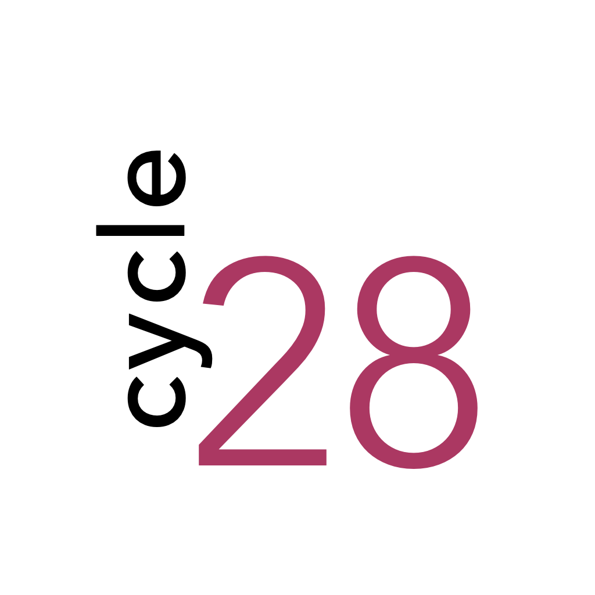
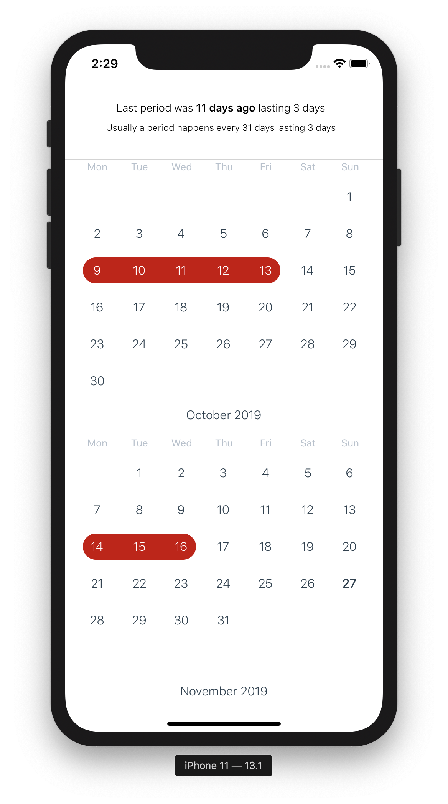

# cycle28 - Cycle Tracking Calendar App

## Why

Because the App Stores is full of bullshit period apps. Over-engineered, over-designed, none-private, childish... Nothing like a good old calendar.

cycle28 is a plain calendar for cycle tracking with its data stored on your local device, full stop!

## Idea

- Primary Target: iOS
- React Native because PWA cannot reliably store data on iOS Safari
- Calendar with monthly view

## TODO

- Calendar logic
- Monthly view
- Storage
- Deployment

